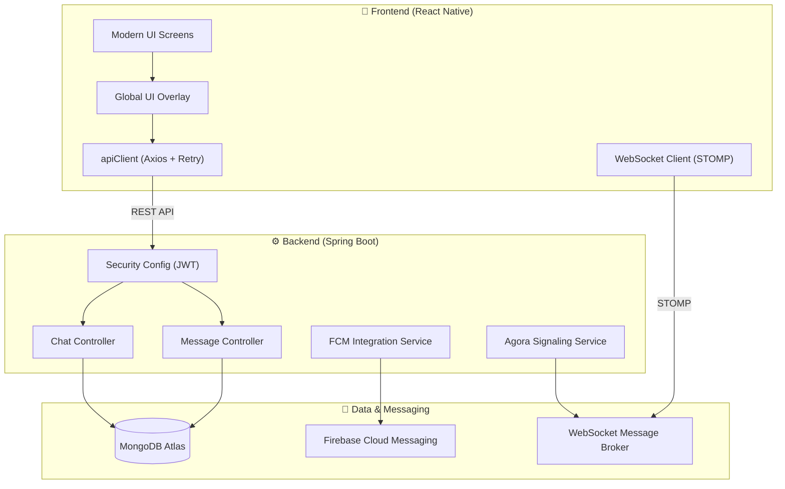

# 🚀 Chat App - Premium Real-Time Messaging

A high-performance, full-stack real-time chat application featuring a sleek dark-mode UI, robust system resilience, and cross-platform mobile support. Built with **React Native (CLI)** and **Java Spring Boot**, optimized for production-grade scalability.

---

## 📁 Project Structure

```text
├── backend/
│   ├── src/main/java/com/chatapp/backend/
│   │   ├── config/          # Security & WebSocket Configuration
│   │   ├── controller/      # REST API Endpoints
│   │   ├── model/           # MongoDB Entities
│   │   ├── repository/      # Data Access Layer
│   │   └── service/         # Business Logic & FCM Services
│   ├── Dockerfile           # Backend Containerization
│   └── pom.xml              # Maven Dependencies
└── frontend/
    ├── src/
    │   ├── components/      # Reusable Global UI Components
    │   ├── navigation/      # React Navigation Stack/Tabs
    │   ├── screens/         # Feature Screens (Chat, Profile, etc.)
    │   ├── services/        # API & WebSocket Clients
    │   └── utils/           # Haptics, Global UI, & Helper Functions
    ├── index.js             # Entry Point
    └── App.jsx              # Root Component
```

---

## 🏗 System Architecture



---

## 📱 Premium Features

### 💬 Messaging Experience
- **Advanced UI**: Redesigned chat bubbles with grouping logic, inverted high-performance scrolling, and date separators.
*   **Stickers & Emojis**: Fully integrated sticker packs and custom emoji keyboard.
*   **Multimedia**: Support for image uploads and real-time document sharing.
*   **Group Chat**: Dedicated conversation threads for groups with flexible metadata management.

### 🛡 Core System
- **Global UI Overlay**: Centralized animated loading overlays and premium toast notifications.
*   **API Resilience**: 3-stage auto-retry logic with exponential backoff for handling intermittent network or server issues.
*   **Render Optimization**: Intelligent "Waking up server" status tracking specifically optimized for Render cold starts.
- **Offline Support**: Local message caching using AsyncStorage for a seamless experience.

### 🔒 Security & Presence
- **JWT Authentication**: Secure sessions with unified token management.
- **Online Presence**: Real-time status tracking (Online/Offline/Last Seen).
- **Haptic Feedback**: Integrated tactile responses for a superior mobile feel.

---

## 🛠 Tech Stack

| Frontend Layer | Technology |
| :--- | :--- |
| **Framework** | React Native (CLI) |
| **Navigation** | React Navigation (Stack, Tabs) |
| **Networking** | Axios with custom Interceptors & Retries |
| **Real-time** | SockJS & STOMP Protocol |
| **State** | Global UI Emitter & AppContext |
| **UI Icons** | Ionicons (react-native-vector-icons) |

| Backend Layer | Technology |
| :--- | :--- |
| **Framework** | Java Spring Boot 3 |
| **Security** | Spring Security + JWT |
| **Database** | Spring Data MongoDB |
| **Messaging** | Spring WebSockets (Broker) |
| **Cloud** | Firebase Admin SDK (FCM) |
| **Signaling** | Agora Interactive SDK |

---

## 🚀 Setup & Installation

### Prerequisites
- Node.js & npm / Yarn
- Java JDK 17+
- Android Studio (for Emulator & SDK)
- MongoDB Atlas Account

### 1. Backend Setup (Spring Boot)
1.  Navigate to the `backend` directory:
    ```bash
    cd backend
    ```
2.  Configure backend environment variables.
    ```bash
    MONGODB_URI=<your-mongodb-connection-string>
    JWT_SECRET=<your-long-random-secret>
    
    # Optional features
    AGORA_APP_ID=<your-app-id>
    AGORA_APP_CERTIFICATE=<your-app-certificate>
    FIREBASE_SERVICE_ACCOUNT_JSON=<full-json-string>
    ```
3.  Run the application:
    ```bash
    mvn spring-boot:run
    ```

### 2. Frontend Setup (React Native)
1.  Navigate to the `frontend` directory:
    ```bash
    cd frontend
    npm install
    ```
2.  **FCM Setup**: Place your `google-services.json` in `frontend/android/app/`.
3.  **Configure API URL**: Ensure `frontend/src/config/api.js` is set to your preferred endpoint.
4.  Start local development:
    ```bash
    npm start
    npm run android
    ```

---

## 🐳 Deployment

### Docker Deployment
The backend is containerized for seamless scaling (no local Java/Maven required).

```bash
cd backend
docker build -t chat-app-backend .
docker run -e MONGODB_URI=<uri> -e JWT_SECRET=<secret> -p 8080:8080 chat-app-backend
```

### Render Deployment Notes
- Set `MONGODB_URI` and `JWT_SECRET` in Render dashboard.
- The backend automatically reads `PORT` from the environment for dynamic binding.
- Built-in retry logic handles free-tier "cold starts" gracefully.

---

## 🤝 Contributing
Feel free to fork this repository and submit pull requests.
